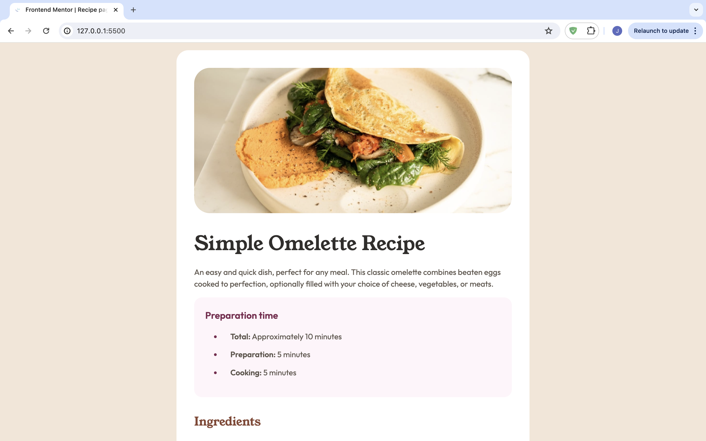

# Frontend Mentor - Recipe page solution

This is a solution to the [Recipe page challenge on Frontend Mentor](https://www.frontendmentor.io/challenges/recipe-page-KiTsR8QQKm). Frontend Mentor challenges help you improve your coding skills by building realistic projects. 

### Screenshot

### Links

- Solution URL: [Github Repo](https://github.com/JyothsnaCh0831/recipe-page-frontend-mentor)

### Built with

- Semantic HTML5 markup
- CSS custom properties
- Custom Fonts
- Media Queries

